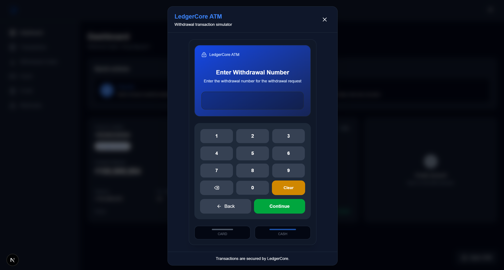

# LedgerCore

**LedgerCore** is a simulated core banking platform built with Java and Spring Boot, designed to model common banking operations and the consistency challenges behind financial transactions.

The project focuses on transaction integrity, double-entry bookkeeping, concurrency control, business-day processing, credit management, asynchronous processing, and reconciliation.

## Features

### Account Management

* Create and manage customer accounts
* Account ownership validation
* Account status management
* Multi-currency support
* Balance management with concurrency control

### Transactions

* Deposit (ADMIN only)
* Withdrawal
* Account-to-account transfer
* Card purchases
* Credit facility repayment
* Fees and interest transactions
* Transaction history and filtering
* Idempotent transaction references

### Double-Entry Ledger

Every financial transaction is reflected in a double-entry ledger.

Examples:

```text
Transfer

Dr Destination / Receiving Account
Cr Source / Sending Account
```

```text
Credit Interest

Dr Credit Facility Receivable
Cr Interest Receivable
```

```text
Credit Fee

Dr Credit Facility Receivable
Cr Fee Income
```

The ledger uses `JournalEntry` and `JournalEntryLine` to maintain accounting entries independently from transaction processing.

### Credit Management

* Credit products
* Credit facility management
* Credit limit and outstanding balance
* Credit statement generation
* Statement payment tracking
* Minimum payment
* Full-balance repayment
* Automatic repayment mandates
* Overdue statement processing
* Credit interest accrual and posting
* Credit fees
* Credit transaction history

Credit statements distinguish between accrued and posted interest:

```text
Interest Amount
    → Interest accrued during the statement period

Posted Interest Amount
    → Interest actually posted to the credit facility
```

Only posted interest affects the credit facility balance and statement closing balance.

### Card Management

* Debit card management
* Credit card management
* Card lifecycle and status management
* Debit card-to-account association
* Credit card-to-credit facility association
* Card authorization and purchase processing
* Credit card statement and repayment integration

### Business Date

The system uses a banking business date instead of relying only on the system calendar date.

It supports:

* Business-day opening and closing
* End-of-day processing
* Business-day validation
* Daily balance snapshots
* Month-end processing
* Interest accrual and posting

### Interest Processing

Interest processing is designed around separate processing runs:

```text
ACCRUAL
   ↓
POSTING
```

For credit:

```text
CREDIT_ACCRUAL
   ↓
CREDIT_POSTING
   ↓
Credit Statement Processing
```

Batch processing supports progress tracking and recovery.

### Asynchronous Processing

RabbitMQ is used for operations that can be processed asynchronously, including background banking workflows.

The project uses the **Transactional Outbox** pattern where reliable event publication is required:

```text
Business Transaction
        ↓
Database Transaction
   ┌────┴─────┐
   ↓          ↓
Business   Outbox Event
Data           ↓
          Message Broker
               ↓
            Consumer
```

### Reconciliation

The ledger and transaction data can be reconciled to detect inconsistencies between:

* Transaction records
* Journal entries
* Account balances
* Credit facility balances

The goal is to make financial inconsistencies detectable and recoverable instead of silently propagating incorrect balances.

---

## Architecture

LedgerCore follows a **modular CQRS + Hexagonal/Clean Architecture** approach.

The architecture is organized primarily by business domain rather than technical layers.

```text
Inbound Adapter
      ↓
Inbound Use Case
      ↓
Command / Query Handler
      ↓
Outbound Port
      ↓
Outbound Adapter
      ↓
Infrastructure
```

For example:

```text
REST Controller
      ↓
TransferMoneyUseCase
      ↓
TransferMoneyHandler
      ↓
AccountBalancePort
      ↓
AccountBalanceAdapter
      ↓
Account Module
```

### CQRS

CQRS is applied selectively where separating commands and queries provides a clear benefit.

Typical structure:

```text
transaction/
├── command/
│   ├── handler/
│   ├── port/
│   ├── repository/
│   └── service/
└── query/
    ├── handler/
    ├── port/
    ├── repository/
    └── service/
```

The project avoids introducing CQRS abstractions where they do not provide meaningful value.

### Domain Modules

Major modules include:

```text
auth
user
customer
account
transaction
ledger
credit
card
interest
businessday
outbox
notification
webhook
reconciliation
common
```

Each module owns its business logic and persistence boundaries.

Cross-module communication goes through inbound/outbound ports instead of directly accessing another module's repository.

---

## Technology Stack

### Backend

* **Java 21**
* **Spring Boot**
* **Spring Data JPA / Hibernate**
* **Spring Security**
* **PostgreSQL**
* **Liquibase**
* **RabbitMQ**
* **Redis**
* **Maven**
* **Docker**

### Frontend

* **Next.js**
* **TypeScript**
* **Tailwind CSS**
* **Axios**
* **Zustand**
* **React Hook Form**
* **Zod**
* **next-intl**
* **Lucide React**

---

## Concurrency and Consistency

Financial operations require stronger consistency guarantees than ordinary CRUD applications.

LedgerCore uses several mechanisms depending on the use case:

### Optimistic Locking

Entities such as credit facilities and statements use JPA optimistic locking:

```java
@Version
private Long version;
```

This helps prevent concurrent updates from silently overwriting each other.

### Pessimistic Locking

Operations that must serialize access to financial state can lock the relevant database row:

```text
SELECT ... FOR UPDATE
```

For example:

```text
Credit Statement
      ↓
Lock statement
      ↓
Calculate repayment
      ↓
Create transaction
      ↓
Update statement
```

### Database Constraints

Important business invariants are also enforced through database constraints where appropriate.

---

## Transaction Flow

A simplified money transfer looks like:

```text
Client
  ↓
REST Controller
  ↓
Transfer Use Case
  ↓
Transfer Handler
  ├── Validate accounts
  ├── Lock balances
  ├── Create transaction
  ├── Update balances
  ├── Create journal entry
  └── Create outbox event
          ↓
      Transaction Commit
          ↓
       RabbitMQ
```

The transaction and ledger remain consistent inside the database transaction.

---

## Credit Repayment Flow

Automatic credit repayment follows:

```text
Credit Statement
      ↓
Repayment Mandate
      ↓
Check Account Balance
      ↓
       ┌───────────────┐
       │ Enough funds? │
       └───────┬───────┘
          Yes  │  No
           ↓   ↓
       Repay    Schedule
        ↓       next attempt
  Update Statement
        ↓
  Transaction + Ledger
```

Supported repayment strategies:

```text
FULL_BALANCE
MINIMUM_PAYMENT
```

Transaction references include the repayment type to keep different repayment operations distinguishable:

```text
CREDIT_REPAYMENT-FULL_BALANCE-{statementId}
CREDIT_REPAYMENT-MINIMUM_PAYMENT-{statementId}
```

---

## Project Structure

```text
ledger-core/
├── ledgercore/          # Spring Boot backend
│   ├── src/
│   │   ├── main/
│   │   │   ├── java/
│   │   │   └── resources/
│   │   └── test/
│   ├── pom.xml
│   └── ...
│
├── frontend/            # Next.js frontend
│   ├── app/
│   ├── components/
│   ├── features/
│   ├── lib/
│   ├── messages/
│   └── ...
│
├── docker-compose.yml
└── README.md
```

---

## Database Migrations

Database schema changes are managed with **Liquibase**.

Each schema change is introduced through a dedicated migration rather than modifying the existing schema manually.

Example:

```text
db/changelog/
├── 001-...
├── 002-...
├── ...
└── master.yaml
```

The application uses Hibernate validation rather than allowing Hibernate to modify the production schema automatically.

```yaml
spring:
  jpa:
    hibernate:
      ddl-auto: validate
```

---

## Running Locally

### Prerequisites

* Java 21
* Maven
* Docker
* Docker Compose
* Node.js

### Environment Variables

Create a `.env` file at the project root, alongside `compose.yaml`:

```text
ledger-core/
├── .env
├── compose.yaml
├── pom.xml
├── src/
└── frontend/
```

Example `.env`:

```env
JWT_SECRET=your_jwt_secret
ENCRYPTION_KEY=your_encryption_key
CARD_ENCRYPTION_KEY_V1=your_encryption_key
CARD_PAN_HASH_SECRET=your_secret
SMTP_AUTH_USERNAME=your_smtp_username
SMTP_AUTH_PASSWORD=your_smtp_password

BUSINESS_DAY_TIMEZONE=Asia/Ho_Chi_Minh
BUSINESS_DAY_CLOSING_CRON=0 30 23 * * *
BUSINESS_DAY_CLOSING_START=23:30:00
BUSINESS_DAY_CLOSING_VALIDATION_ENABLED=true
```

Fill in the values according to your local environment.

For the frontend, create `.env.local` inside the `frontend` directory:

```text
ledger-core/
└── frontend/
    ├── .env.local
    ├── package.json
    └── ...
```

Example `frontend/.env.local`:

```env
API_BASE_URL=http://localhost:8080
```

Do not commit `.env` or `.env.local` if they contain secrets or environment-specific credentials.

### Start Infrastructure

From the project root:

```bash
docker compose up -d
```

### Start Backend

```bash
cd ledgercore
./mvnw spring-boot:run
```

On Windows:

```bash
mvnw.cmd spring-boot:run
```

### Start Frontend

```bash
cd frontend
npm install
npm run dev
```

The frontend is available at:

```text
http://localhost:3000
```

The backend runs on:

```text
http://localhost:8080
```

### Using the Simulated ATM

LedgerCore includes a simulated ATM flow for testing ATM-related operations.

<p align="center">
  
</p>

#### 1. Register an ATM

First, log in with an account that has **ADMIN** access and call the ATM registration endpoint.

The registration response provides:

* ATM terminal code
* ATM credential

Save these values for the frontend configuration.

#### 2. Configure the Frontend

Add the returned ATM credentials to `frontend/.env.local`:

```env
NEXT_PUBLIC_ATM_TERMINAL_CODE=ATM_01ZO2
NEXT_PUBLIC_ATM_CREDENTIAL=nszH7WCe3plqQpkm030NXkR8J67fCfQR
```

Replace the example values with the `terminalCode` and `credential` returned when registering your ATM.

After updating `.env.local`, restart the frontend:

```bash
npm run dev
```

The simulated ATM can then be accessed from the frontend and used to test ATM operations against the LedgerCore backend.

---

## Testing

The project focuses on business-critical tests rather than relying heavily on mock-based tests.

Tests cover areas such as:

* Transaction processing
* Account balance updates
* Credit repayment
* Credit statement generation
* Interest processing
* Business-day processing
* Concurrency-sensitive operations
* Ledger entries
* Validation and business rules

Run backend tests with:

```bash
./mvnw test
```

On Windows:

```bash
mvnw.cmd test
```

---

## Project Goals

LedgerCore is primarily a learning and simulation project focused on understanding how financial backend systems handle:

* Transaction consistency
* Double-entry accounting
* Concurrency
* Idempotency
* Business dates
* Interest processing
* Credit statements
* Asynchronous processing
* Reliable event publishing
* Reconciliation
* Database consistency

The project intentionally favors understandable business flows and explicit boundaries over unnecessary infrastructure complexity.

---

## Disclaimer

LedgerCore is a **simulation and learning project**, not a production banking system.

It does not attempt to implement every regulatory, security, compliance, risk-management, settlement, or operational requirement of a real banking platform.
